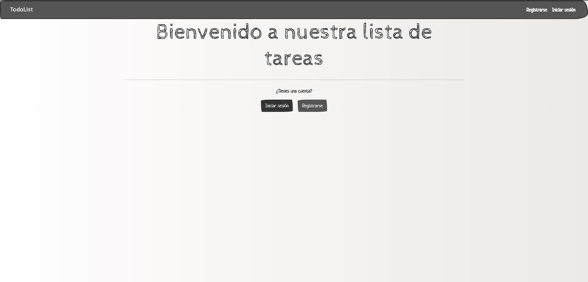
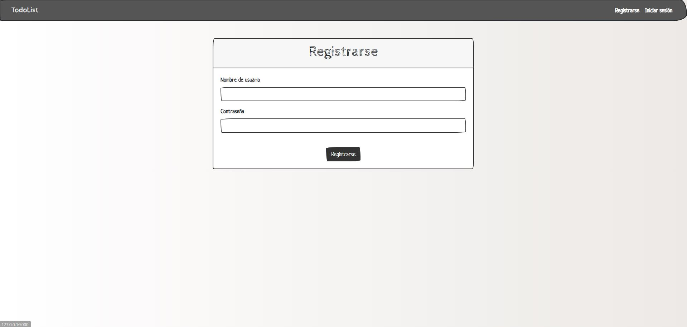
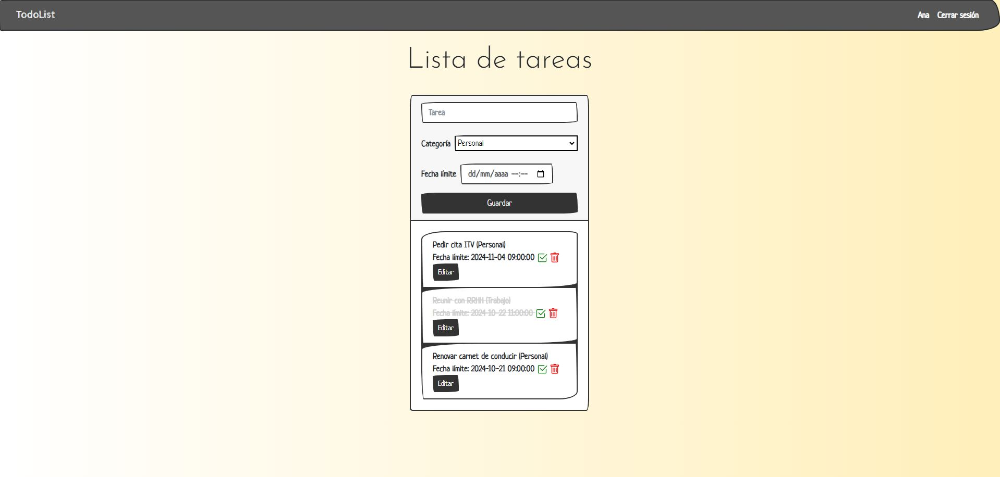
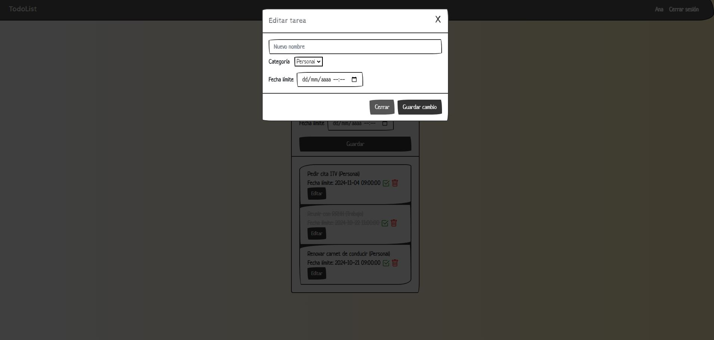

# TODO_LIST_SERVICE
An organizing tool that helps you see and complete all of your daily tasks. It is a list of things to do.

## Description
The todo list application is a website with a connection to a database. This web application aims to be a task manager, that is an application that will allow the user to perform the following actions:
- Session management (register, login, log in, log out)
- Create tasks
- Mark a task as completed
- Edit tasks
- Delete tasks

## Technology stack used
##### Front-End Development Languages:
- HTML5
- CSS3

##### Front-End Development Skills:
- Jinja
- Bootstrap
- Google Fonts
- uiGrandients

##### Back-End Development Languages:
- Python 3.11
- Flask
- SQLite
- SQLAlchemy

## To do list preview





## Installation 
To run this project, first you need to install the dependencies with pip. Just run ```pip install -r requirements.txt```. To start the application, run ```python main.py```.